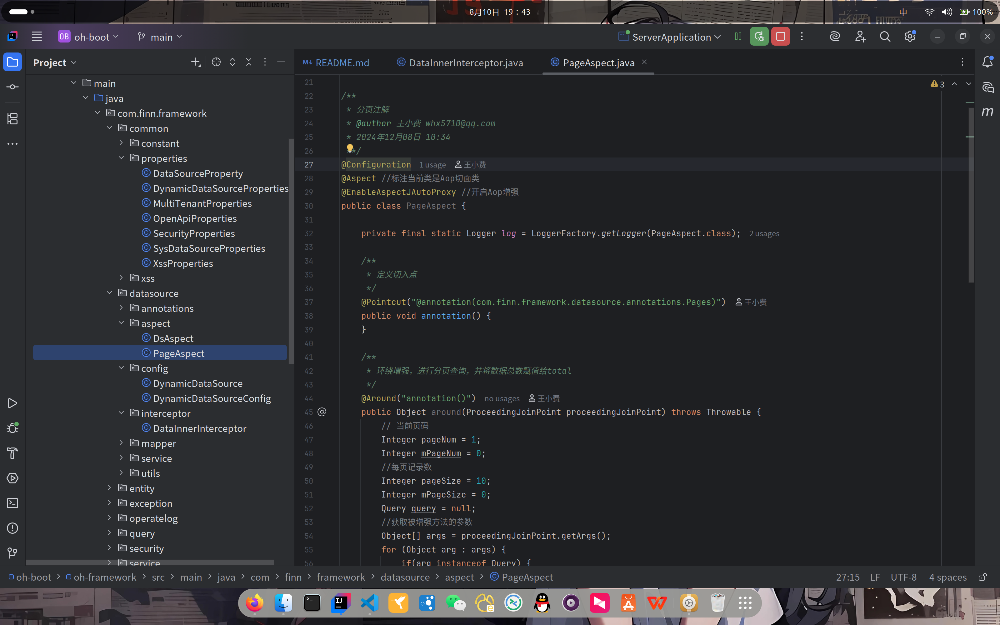
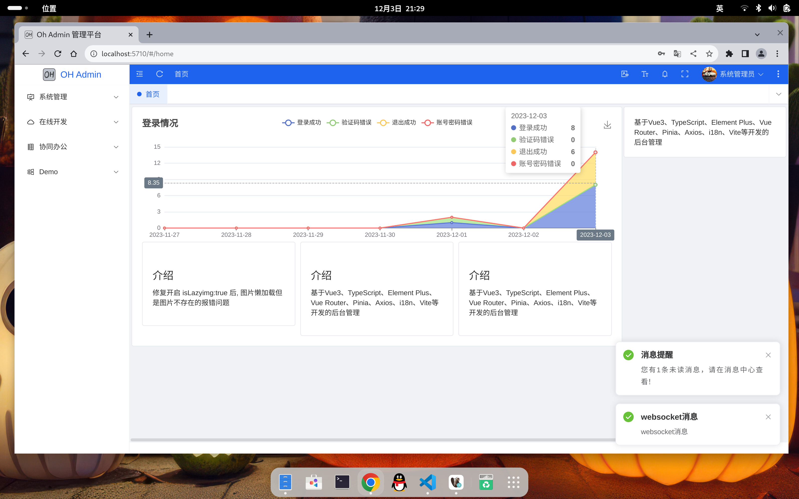
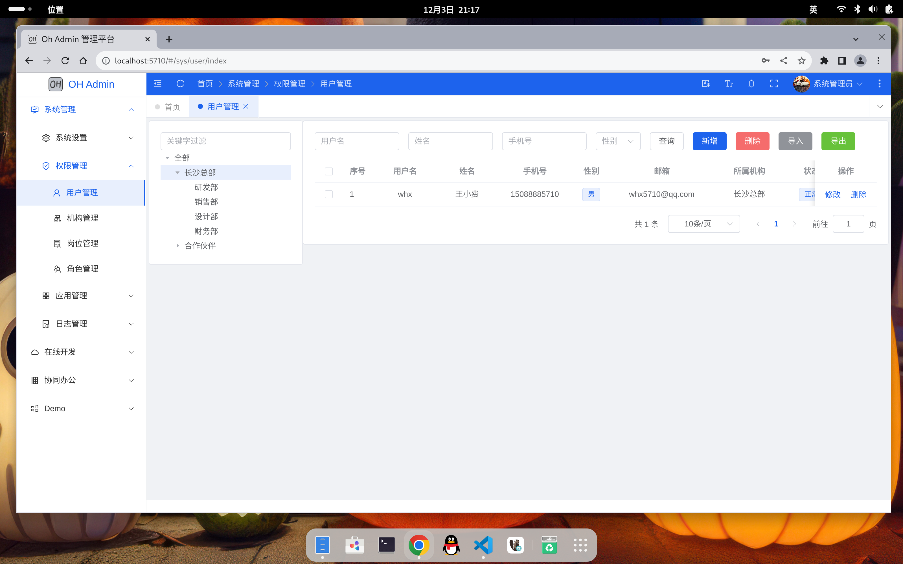
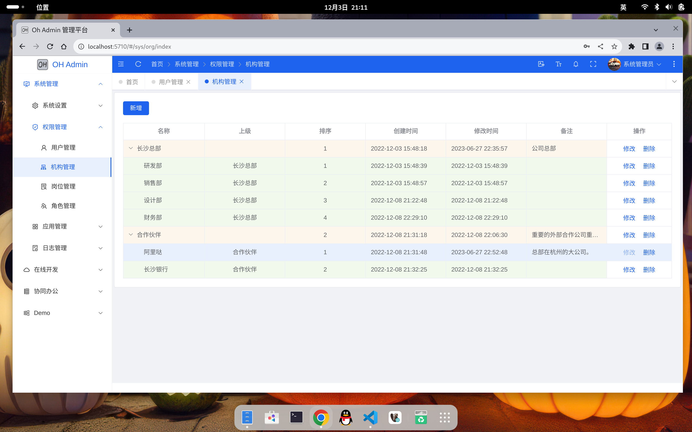
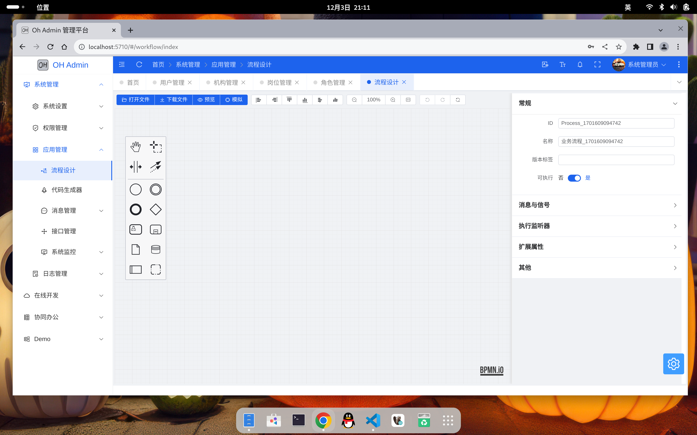
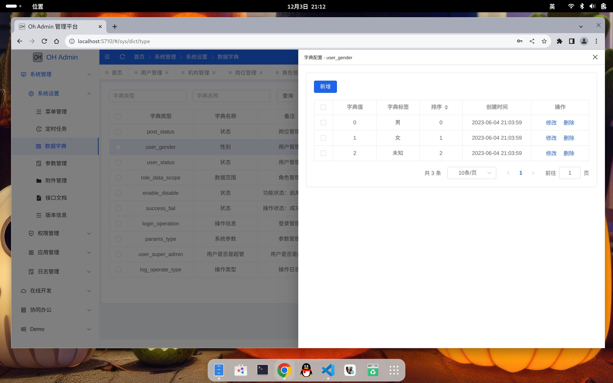
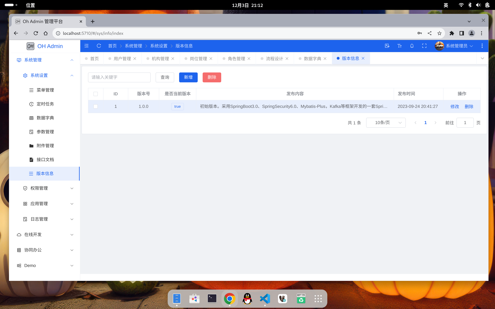
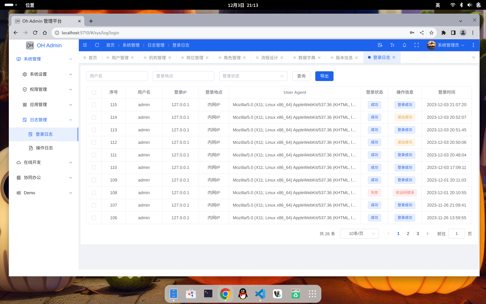

## 项目说明

oh-boot 是采用SpringBoot3.0、SpringSecurity6.0、Mybatis、Druid连接池、Kafka等框架开发的一套SpringBoot快速开发平台。
- 采用组件模式，扩展不同的业务功能，可以很方便的实现各种业务需求，若想使用某个组件，按需引入即可。
- 通用接口，可对接入客户端接口级别授权。加入Kafka/RocketMq，支持MQ异步接口，支持海量请求。
- 通过Druid连接池支持多数据源，通过前端参数或后端AOP、@Ds注解切换数据源，@Page分页。
- 支持定时任务（分布式可使用xxl-job）、文件存储、短信对接等。
- 前端集成bpmn.js，使用camunda流程引擎，画流程如此简单。
- 完善的资源监控，可监控服务器资源，数据库连接等。
- 保姆级注释，确保每行代码都能看懂，开发无忧。
- 严格的接口角色权限控制，拒绝垂直越权。
- 工程代码：https://gitee.com/whx233/oh-boot
- - 独立系统管理 https://gitee.com/whx233/oh-sys (从oh-boot剥离)
- - 前端工程    https://gitee.com/whx233/oh-admin (暂未开源 Vue3)
- 开发文档：
- 演示环境：
- 官网地址：

## 代码目录  
`oh-common`、`oh-core`、`oh-framework`属于系统框架类模块，各自存放相关的代码
```
oh-common    公共框架，包括操作日志工具、excel工具等，按需引入
oh-core      核心系统框架，最基础的系统功能，包括缓存、异常、基础工具类
oh-framework 系统框架，包括数据库、基础实体类、鉴权
oh-support   基础组织机构信息，如人员、角色、部门等，业务模块中可按需引入
oh-server    系统启动入口【根据实际情况，可集成到某个模块中】
oh-module    业务模块
    - oh-module-sys    系统管理模块，包括组织架构，基础配置等
    - oh-module-app    对外服务接口
    - oh-module-flow   工作流程管理
    - oh-module-team   协同管理【业务功能，未开发】
    - ...              扩展其他业务模块
```
通过`oh-core`、`oh-common`(按需)、`oh-framework`即可很方便、快捷的搭建开发环境；比如需将系统管理的基础功能独立成一个工程，

## 快速开始
环境：JDK17+、MySQL8+、Redis、Kafka(RocketMq)
- 1、克隆项目 `git clone https://gitee.com/whx233/oh-boot.git`
- 2、创建数据库，分别创建 oh-sys 和 oh-boot数据库（可合并成一个库），并分别执行db\mysql目录下的SQL脚本
- 3、根据实际情况修改application-xxx.yml 配置，包括MySQL、Redis、Kafka/RocketMq（如果需要）、文件存储路径等
- 4、启动服务 `com.iris.ServerApplication`
- 5、API文档地址：http://localhost:8080/doc.html 数据库监控地址：http://localhost:8080/druid/login.html

## 沟通交流

邮箱：whx5710@qq.com 【王小费】


## 效果图



















