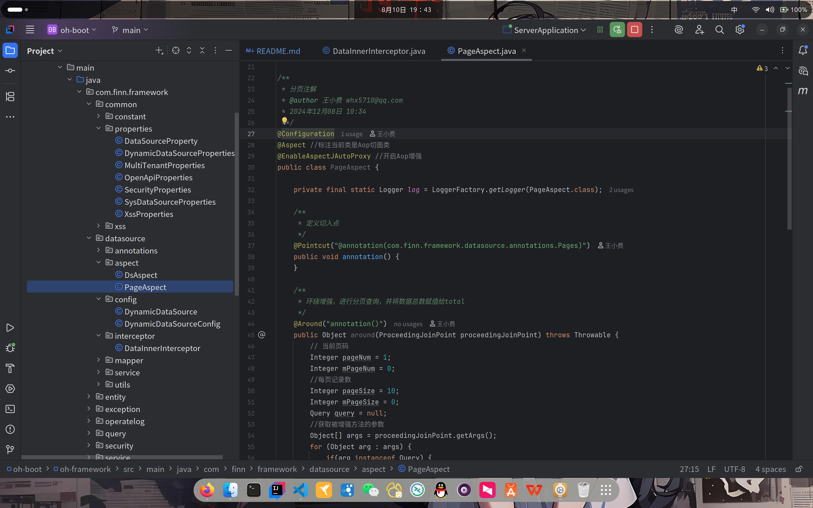
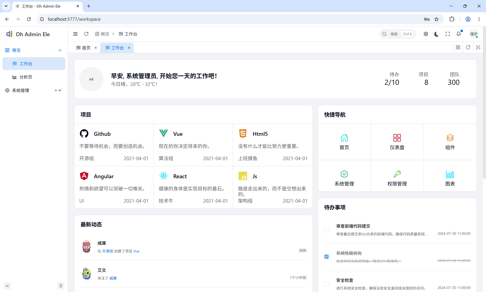
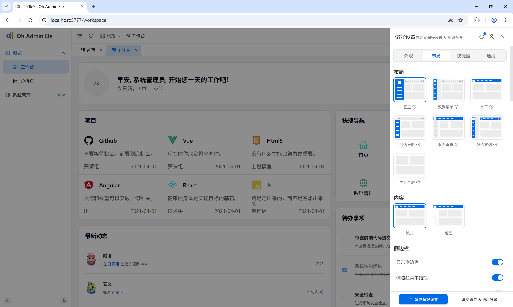
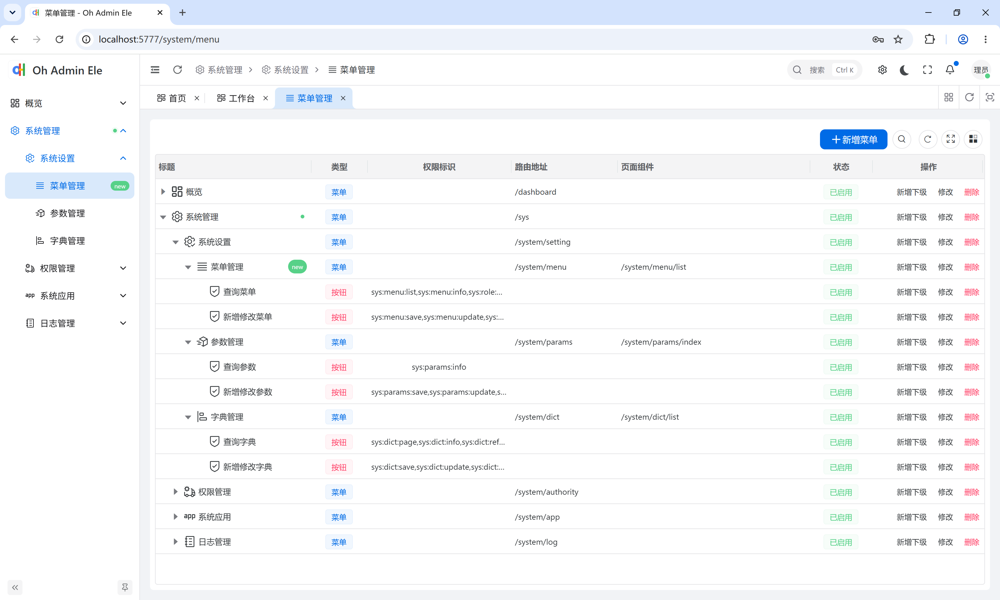
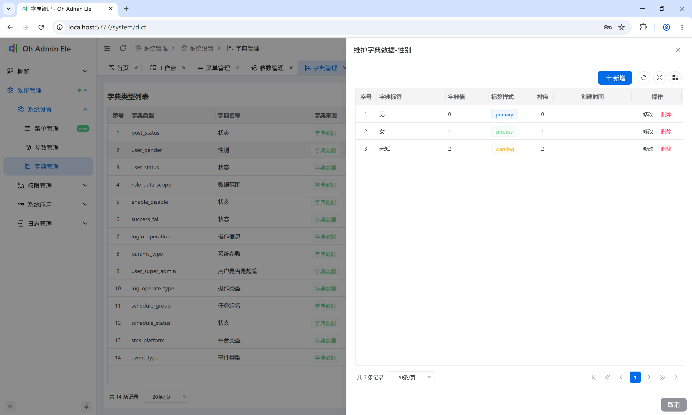
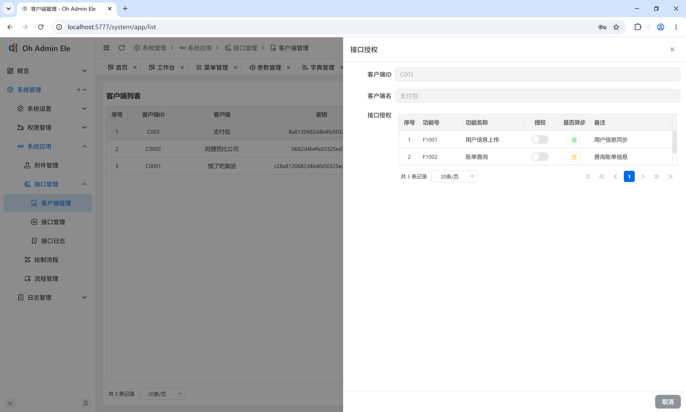
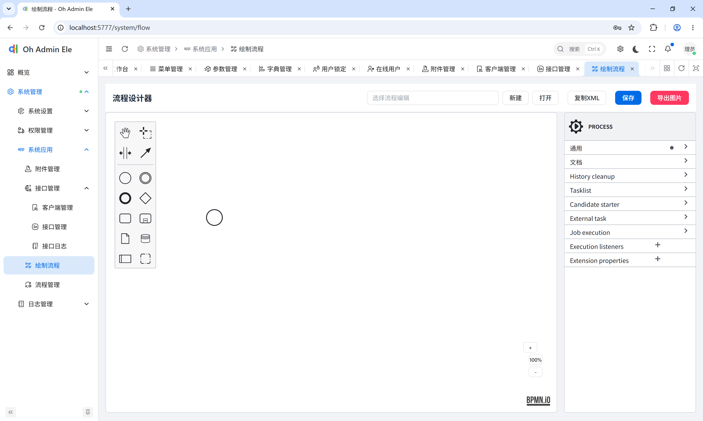
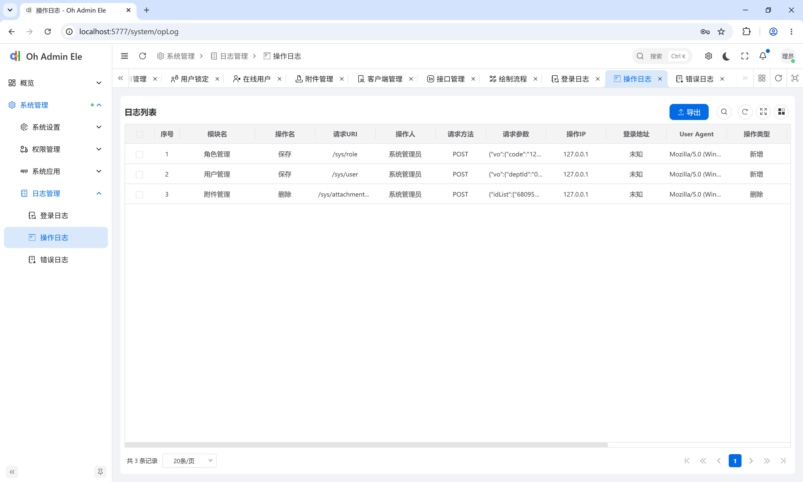
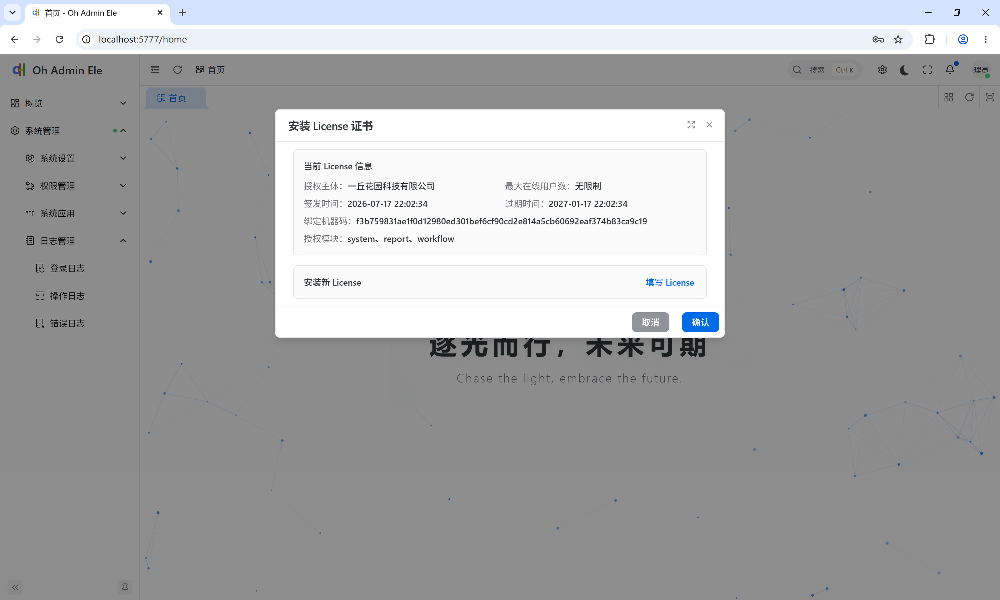

## 项目说明

oh-boot 是采用SpringBoot4.0、SpringSecurity7.0、Mybatis（如需改Mybatis-Plus请自行引入依赖包）、Druid连接池、Kafka等框架开发的一套SpringBoot快速开发平台。
- 采用组件模式，扩展不同的业务功能，可以很方便的实现各种业务需求，若想使用某个组件，按需引入即可。
- 支持定时任务（分布式可使用xxl-job）、文件存储、短信对接等。
- 前端集成bpmn.js，使用~~camunda~~ Flowable流程引擎，画流程如此简单。
- 完善的资源监控，可监控服务器资源，数据库连接等。
- 保姆级注释，确保每行代码都能看懂，开发无忧。
- 严格的接口角色权限控制，拒绝垂直越权。
- 通用接口，可对接入客户端接口级别授权。加入Kafka/RocketMq，支持MQ异步接口，支持海量请求。
- 支持多数据源，通过前端参数或后端AOP、@Ds注解切换数据源，@Pages分页 【2024年10月】
- 通过@TableName、@TableField和@TableId注解，结合ProviderService动态SQL拼接，支持简单的新增、修改和删除功能，少写SQL 【2024年12月】
- 幂等注解 @Idempotent、@RequestKeyParam 加锁防止重复提交，限制请求频率 【2024年12月】
- 增加租户功能，隔离业务数据 【2025年1月】
- 支持~~Druid~~、Hikari连接池【2025年2月】
- BaseMapper接口支持单表通用操作：通过QueryWrapper构建sql，无需编写脚本【2025年3月】
- 接口文档解决方案改用smart-doc + Torna 无侵入式，文档统一管理【2025年5月】
- BaseMapper接口支持单表通用操作;新增插入(InsertWrapper)、修改（UpdateWrapper）、删除（DeleteWrapper）脚本构建方法，无需编写sql脚本【2025年6月】
- BaseMapper通用操作;新增汇总统计count方法(CountWrapper)【2026年2月】
- 升级到spring boot 4【2026年3月】
- 租户数据拦截优化，不依赖Druid包，基于jsqlparser进行sql操作【2026年3月】
- 去掉Druid连接池，暂不支持springboot4，Hikari连接池增加慢sql监测，后期默认使用Hikari连接池【2026年3月】
- 支持postgres，增加建表sql，划分mysql、pg脚本目录，根据项目需求选择对应的数据库【2026年3月】
- oh-core模块合并到oh-framework，简化框架,升级spring-boot 4.0.5【2026年4月】
- 增加批量插入insertBatch(List<T>)通用方法【2026年4月】
- 后端代码：
- - Gitee https://gitee.com/whx233/oh-boot.git
- - GitHub https://github.com/whx5710/oh-boot.git
- 前端工程：
- - Gitee https://gitee.com/whx233/oh-web.git
- - GitHub https://github.com/whx5710/oh-web.git
- 开发文档：
- 演示环境：
- 官网地址：

### 后期计划支持多种数据（postgresql、国产数据库）

## 代码目录  
`oh-framework`属于系统框架类模块，项目上可独立打成jar包引入

~~oh-core      核心系统框架，最基础的系统功能，包括缓存、异常、基础工具类~~ 【2026年4月合并到oh-framework】
```

oh-framework 系统框架，包括数据库、基础实体类、鉴权
oh-system    系统管理模块，包括组织架构、鉴权、基础配置等
oh-module    业务模块
    - oh-module-app    对外服务接口
    - oh-module-flow   工作流程管理
    - ...              扩展其他业务模块
```
通过引入`oh-framework`即可很方便、快捷的搭建开发环境，也可把业务模块单独剥离部署做负载均衡。

## 快速开始
环境：JDK17+、MySQL8+（Postgresql）、Redis、Kafka（如果需要）
- 1、克隆项目 `git clone https://gitee.com/whx233/oh-boot.git`
- 2、创建数据库，分别创建 oh_sys 和 oh_boot数据库（可合并成一个库），并执行db\mysql目录下的SQL脚本（根据实际数据库执行）
- 3、根据实际情况修改application-xxx.yml 配置，包括MySQL、Redis、Kafka、文件存储路径等
- 4、启动服务 `com.finn.ServerApplication`
- 5、API文档地址：自行部署发布Torna

注：切换数据库只需调整jdbc驱动配置（引入驱动依赖`oh-framework/pom.xml`） 和`mybatis.mapper-locations`路径配置

## 配置说明
```yaml
finn:
  multi-tenant: # 多租户配置
    tenant-id-field: tenant_id # 隔离字段名称，默认tenant_id
    table-pattern: ^t_.* # 需要隔离的表名称（正则表达式）
    # 排除隔离的表（逗号分隔） sys_params,sys_version_info,sys_menu,sys_role_menu,sys_user_role,sys_user_post 已写到代码中
    ignore-table: sys_dict_type,sys_dict_data
  security:
    access-token-expire: 7200      # 过期时间-秒，2小时过期
    refresh-token-expire: 43200    # 刷新token-秒 12小时
    auth-count: 5                   # 多少次鉴权失败锁定，0表示不开启
    lock-time: 3600                 # 账号锁定时间(秒)
    ignore-urls:                    # 忽略鉴权的url
      - /doc/**
  open-api:
    type: 2 # 1直接保存 2使用MQ异步保存，默认直接保存
    auto-start-up: false # Kafka监听是否开启,默认不开启false
    cache-time: 604800 # 缓存时间-秒，0不进行缓存，缓存日志可从redis中读取日志保存到表中
  xss:
    enabled: true
    exclude-urls:
      - /oh-generator/**
  # 文件存储相关
  storage:
    enabled: true
    config:
      type: local  # 存储类型：local、aliyun、tencent、qiniu、huawei、minio
      domain: http://localhost:8080
    local.path: /data/图片/upload
# https://docs.spring.io/spring-boot/docs/current/reference/html/application-properties.html
spring:
  datasource:
    # 默认hikari连接池
    type: com.zaxxer.hikari.HikariDataSource
    sys-data-source:
      primary: masterDb # 主数据源或者数据源组,默认 masterDb
      sys-default: sysDb # 系统管理的数据源，默认 sysDb，用于基础管理的库，如果合并为一个库，则与主数据库相同
    dynamic: # 数据源配置，支持多数据源
      sysDb: # 数据源1 
        driver-class-name: com.mysql.cj.jdbc.Driver
        url: jdbc:mysql://127.0.0.1:3306/oh-sys?useUnicode=true&characterEncoding=UTF-8&serverTimezone=Asia/Shanghai&nullCatalogMeansCurrent=true
        username: root
        password: 123456
        hikari: # 默认hikari连接池
          minimum-idle: 10 # 连接池中保持的最小空闲连接数
          maximum-pool-size: 100 # 连接池中允许的最大连接数
          connection-timeout: 30000 # 连接超时时间 (毫秒) (默认: 30000)
          max-lifetime: 1800000 # Hikari属性,控制池中连接的最长生命周期，值0表示无限生命周期，默认30分钟
          idle-timeout: 600000  # 连接空闲超时时间 (毫秒) (默认: 600000)
          connection-test-query: SELECT 1 # 连接测试查询语句,默认SELECT 1
          auto-commit: true # 自动提交 (默认: true)
          validation-timeout: 5000 # 验证超时时间，默认5秒
          isolate-internal-queries: false # 是否隔离自动提交事务 (默认: false)
          check-connection: true # 初始化时是否检查连接，默认false
          hikari-log: true # 是否开启hikari监控日志打印，默认false
          slow-threshold: 500 # 慢查询阈值,默认1000（毫秒）
      mysqlDb: # 数据源2 配置同 sysDb
        driver-class-name: com.mysql.cj.jdbc.Driver
# 日志信息
logging:
  # 字符集设置
  charset:
    file: UTF-8
    console: UTF-8
  level:  # 默认的全局日志级别 TRACE, DEBUG, INFO, WARN, ERROR, FATAL, OFF
    com.finn: DEBUG
    org.springframework.web: debug # web相关的日志级别

```
## 沟通交流

邮箱：whx5710@qq.com 【王小费】

## 效果图




















## 捐赠
如果你认为这个项目对你有帮助，你可以帮作者买一杯奶茶来表达你的支持！


