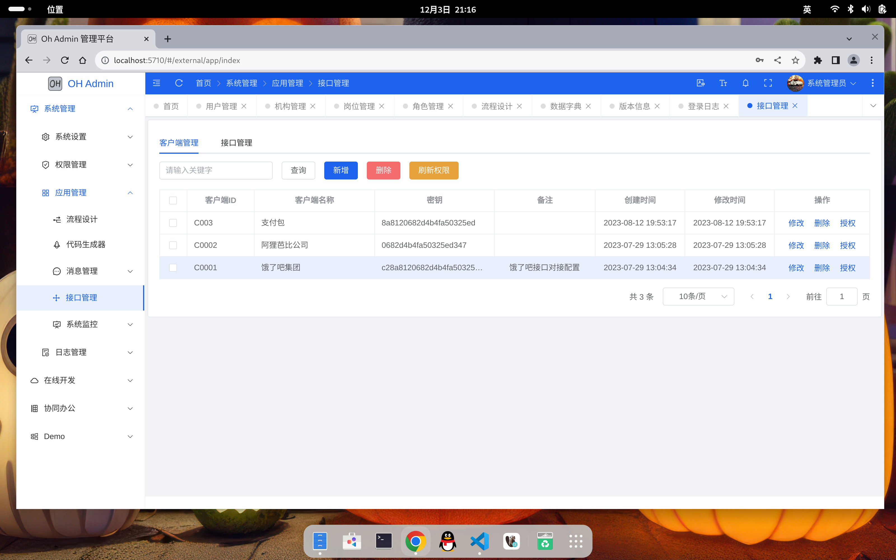

## 项目说明

oh-boot 是采用SpringBoot3.0、SpringSecurity6.0、Mybatis-Plus，Kafka等框架开发的一套SpringBoot低代码开发平台，注释完整全面，支持多数据源。
- 采用组件模式，扩展不同的业务功能，可以很方便的实现各种业务需求，若想使用某个组件，按需引入即可。
- 通用接口，可对接入客户端接口级别授权。加入Kafka，支持MQ异步接口，支持海量请求。
- 支持每个数据库独立初始化表结构schema和数据库database（初始化后请屏蔽屏蔽）。
- 支持多数据源，可通过前端参数或后端配置不同的数据源，不同业务数据分开储存。
- 前端集成bpmn.js，使用camunda流程引擎，画流程如此简单。
- 支持代码生成功能、定时任务、文件存储、短信对接等。
- 保姆级注释，确保每行代码都能看懂，开发无忧
- 工程代码：https://gitee.com/whx233/oh-boot
- - 独立系统管理 https://gitee.com/whx233/oh-sys
- - 前端工程    https://gitee.com/whx233/oh-admin (暂未开源)
- 开发文档：
- 演示环境：
- 官网地址：

```
oh-parent    父级结构，依赖版本管理
oh-framework 系统框架
oh-system    系统启动入口、基础功能管理【根据实际情况可独立部署】
oh-module    业务模块
    - oh-module-api    对外服务接口
    - oh-module-flow   工作流程管理
    - oh-module-team   协同管理【业务功能，未开发】
    - ...              扩展其他业务模块
```
通过`oh-parent` 和 `oh-framework`即可很方便、快捷的搭建开发环境；比如需将系统管理的基础功能独立成一个工程，
只需将`oh-parent`、`oh-framework` 和 `oh-system`组装成一个独立工程即可，也可以根据业务需求和服务器资源划分成不同的后端服务工程。
参考系统管理工程 https://gitee.com/whx233/oh-sys

## 沟通交流

邮箱：whx5710@qq.com 【王小费】


## 效果图



